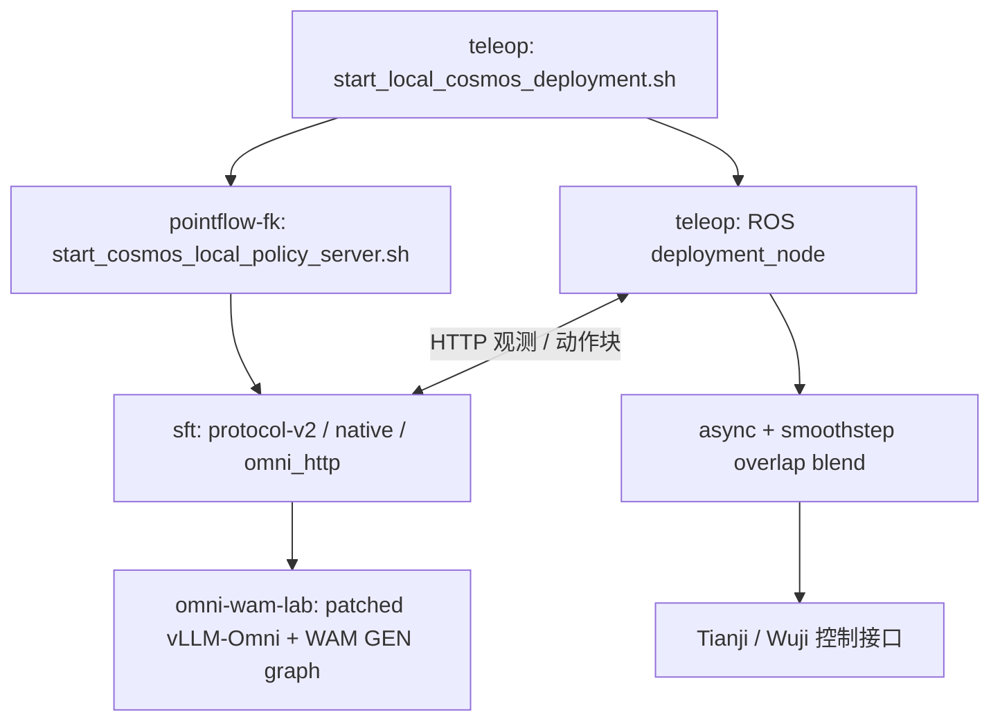

# Cosmos Deployment

将机器人控制、Cosmos WAM 推理、vLLM-Omni 加速和 PointFlow/FK 研究代码放在同一个仓库中，统一维护部署链路和实验结论。主要应用为 Tianji 机械臂 + Wuji 灵巧手的视觉闭环操作。

这是 **2026-10-07 本地工作源码的统一快照**，包含各项目当时尚未单独提交的修改；原项目目录和历史保持不变。这里没有合并各仓库的 Git 历史，也没有打包权重、Python 环境或真机录像。新仓库不是安装完成即可直接驱动机器人的镜像。

## 目录结构

```text
cosmos-deployment/
├── README.md
├── cosmos-deployment.code-workspace   # VS Code 统一工作区
├── docs/
│   ├── IMPORT.md                     # 导入范围、来源和复现边界
│   ├── EXTERNAL_DEPENDENCIES.md       # 权重、模型组件、驱动和环境
│   └── source_snapshot.json           # 源文件 SHA256、来源版本、排除清单
├── wuji-hand-teleop-pipeline/
│   ├── src/scripts/                  # 本地/云端启动、测速及诊断入口
│   ├── src/wuji_data_pipeline/        # ROS 数据管线、动作调度、配置、测试
│   ├── src/input_devices/            # 遥操作输入设备集成
│   ├── src/output_devices/           # 机械臂/灵巧手输出设备集成
│   ├── src/wuji-retargeting/          # 重定向代码快照
│   ├── sim/                          # 仿真相关代码
│   ├── docker/                       # ROS 容器和构建配置
│   ├── patches/                      # 外部 wujihandros2 的本地功能补丁
│   └── docs/                         # 部署指南和实验过程
└── WorldAct/
    ├── COSMOS_DEPLOYMENT_MAP.md       # 跨组件入口和调用关系
    ├── WorldAct-sft/                 # 当前 50k 原生推理、Omni HTTP 适配
    ├── WorldAct-sft-pointflow-fk/     # 服务启动器、部署 YAML、联合去噪扩展
    ├── WorldAct-sft_base/            # 保留的 SFT 基础工作树快照
    ├── WorldAct-bench2dex/            # Bench2Dex 相关 Cosmos 工作树快照
    ├── Bench2Dex-Pointflow-fk/        # 仿真、策略、数据处理和 PointFlow/FK 工具
    ├── omni-wam-lab/                 # WAM 加速、导出、profile、固定 Omni 源码
    ├── models/cosmos3-edge-droid/    # 模型包转换代码和配置；权重另外准备
    └── model_ch/real_ckpt/           # 训练/部署 frozen YAML；不含 checkpoint
```

这些 SFT 目录是独立代码变体，暂时保留目录名，避免错误合并训练与推理实现。它们现在均由本仓库管理，不再作为嵌套 Git 工作树。

## 当前部署如何调用



50k 启动器默认使用 `WorldAct-sft` 的完整推理源码。`WorldAct-sft-pointflow-fk` 提供当前服务启动脚本及配置；命令引用它的 YAML **不表示启用了 PointFlow/FK 联合去噪**。Omni 的普通 video + action WAM 路线已经接入；PointFlow/FK 的 Omni 联合去噪仍需另行开发和验证。

重点代码：

| 功能 | 位置 |
|---|---|
| 启动参数、后端选择、会话记录 | [本地启动器](wuji-hand-teleop-pipeline/src/scripts/start_local_cosmos_deployment.sh) |
| 服务配置、Python 和源码目录选择 | [服务启动器](WorldAct/WorldAct-sft-pointflow-fk/script/start_cosmos_local_policy_server.sh) |
| 原生与 Omni 服务实现 | [robot_policy](WorldAct/WorldAct-sft/cosmos_framework/inference/robot_policy/) |
| 观测时钟、异步调度与混合 | [wuji_data_pipeline](wuji-hand-teleop-pipeline/src/wuji_data_pipeline/wuji_data_pipeline/) |
| CUDA Graph 与后端优化 | [omni-wam-lab](WorldAct/omni-wam-lab/) |
| 当前客户端配置 | [async_blend.yaml](wuji-hand-teleop-pipeline/src/wuji_data_pipeline/config/cosmos_protocol_v2_50k_retrain_async_blend.yaml) |

## 当前保留的实验配置

- 单张 RTX 5090；50k-retrain-v1-0831 的 `iter_000040000`、EMA 权重。
- Omni：FP8 linear、cuDNN attention、串行 CFG、GEN CUDA Graph；UniPC 4 步、guidance 3、shift 5。
- 每块 32 个动作、15 Hz 模型时间；ROS 以 120 Hz 插值发布。120 Hz 不是模型推理频率。
- `async + blend`：按观测时间推进，stride 16；重叠区使用旧块剩余轨迹与新块混合，smoothstep 权重，手臂/手指同权。
- 顺序执行、固定跳步、8/2 等旧实验 YAML 仍保留用于回归，不应把它们的参数混用到当前方案。

两次真机 trace 的中位数对照：

| 相同 smoothstep 衔接方式 | Omni | 原生 |
|---|---:|---:|
| 服务端推理 | 411.10 ms | 590.75 ms |
| 客户端 RTT | 434.66 ms | 607.13 ms |
| 超过 100 ms 的命令发布间隔 | 0 | 0 |

这是指定会话的测量，不是所有场景的速度保证，也不表示 FP8 与原生数值等价。现场对 Omni 该轮反馈为“感觉不错”；不据此推导任务成功率。详细边界与会话编号见 [加速和异步衔接实验记录](wuji-hand-teleop-pipeline/docs/cosmos_5090_optimization_experiments_20261007.md)。

## 准备环境与启动

1. 按 [外部依赖说明](docs/EXTERNAL_DEPENDENCIES.md) 准备权重、VAE/tokenizer、Omni 导出模型、Python 环境与硬件驱动。
2. 按 [teleop README](wuji-hand-teleop-pipeline/README.md) 和 [部署 Quickstart](wuji-hand-teleop-pipeline/docs/cosmos_local_quickstart.md) 配置 ROS 容器与相机。容器必须挂载本仓库的 `wuji-hand-teleop-pipeline/src`。
3. 打开根目录 `cosmos-deployment.code-workspace` 可以同时看到所有组件。各子项目依赖环境不同，不能在根目录统一执行一次 `pip install` 代替它们的安装。

下面是完成环境准备后的 Omni 启动命令。路径按仓库内的相对布局书写；导入的 frozen 配置及部分旧研究脚本仍可能含原机器绝对路径，迁移前需核对。

```bash
cd wuji-hand-teleop-pipeline
COSMOS_DEPLOYMENT_CONFIG=../WorldAct/WorldAct-sft-pointflow-fk/examples/deployment/cosmos_singlerighthand_50k_retrain_v1_edge_protocol_v2.yaml \
./src/scripts/start_local_cosmos_deployment.sh \
  --backend omni \
  --port 18006 \
  --record-video \
  --checkpoint-dir ../WorldAct/model_ch/real_ckpt/singlerighthand-edge-droid-50k-retrain-v1-0831/iter_000040000 \
  --model-config-file ../WorldAct/model_ch/real_ckpt/singlerighthand-edge-droid-50k-retrain-v1-0831/config.deploy.yaml \
  --model-package ../WorldAct/models/cosmos3-edge-droid \
  --inference-repo ../WorldAct/WorldAct-sft \
  --omni-root ../WorldAct/omni-wam-lab \
  --omni-model ../WorldAct/omni-wam-lab/artifacts/4w-ema-omni \
  --service-mode full \
  --config /home/wuji/ros2_ws/src/wuji_data_pipeline/config/cosmos_protocol_v2_50k_retrain_async_blend.yaml
```

添加 `--check-only` 可先检查路径与服务导入，不启动 GPU 推理、HTTP、Docker、ROS 或硬件；它不替代模型加载和真机验证。服务就绪后仍由操作者按 `r`/`a` 执行恢复和使能，`q` 退出。

原生对照使用 `--backend native`，去掉 `--omni-*` 和 `--record-video`，其他模型及客户端配置保持一致。不要同时启动两个占用相同 GPU／端口或控制同一机器人的会话。

## 文档与维护

- [完整优化／实验记录](wuji-hand-teleop-pipeline/docs/cosmos_5090_optimization_experiments_20261007.md)：5090 后端优化、论文 async+blend、实测对照。
- [部署 Quickstart](wuji-hand-teleop-pipeline/docs/cosmos_local_quickstart.md)：操作入口及历史配置说明。
- [跨组件导航](WorldAct/COSMOS_DEPLOYMENT_MAP.md)：服务和控制的实际职责。
- [导入记录](docs/IMPORT.md)：包含/排除范围、来源版本和迁移限制。

后续功能按 feature 提交；涉及推理与控制的同一修改可在一个提交中原子更新。不要在这些源码目录内重新初始化 Git。运行记录、视频和大模型继续放在外部存储；提交实验结论及必要的小型统计报告，并写明会话 ID、配置和代码版本。

各组件和第三方代码沿用其原有 LICENSE、NOTICE 和 ATTRIBUTIONS。统一仓库不改变其许可或权重的使用条款。
