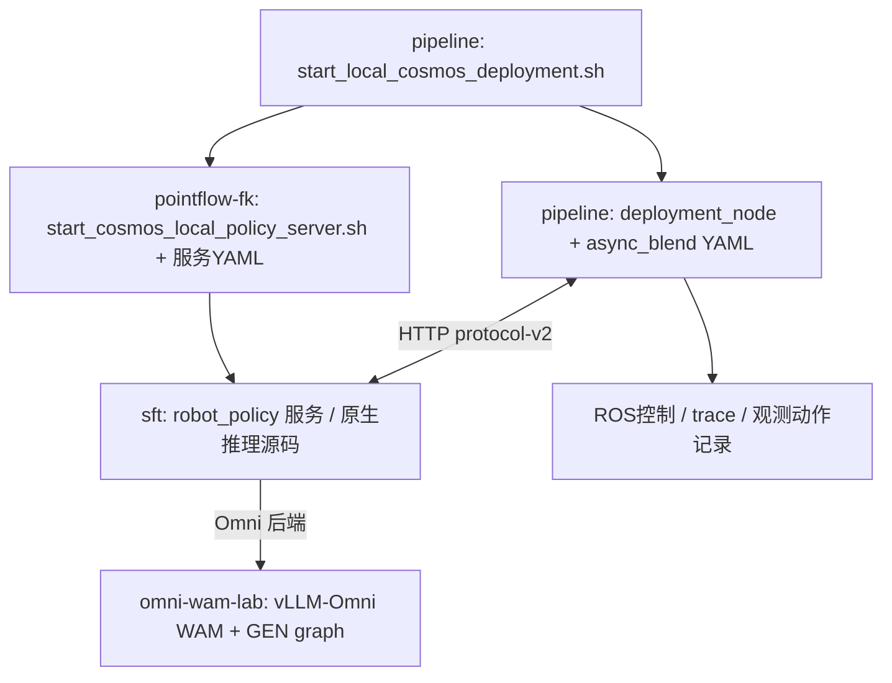

# Cosmos 本地部署：跨仓库导航

更新：2026-10-07。本文件保留各组件导航；统一仓库的范围、依赖和版本说明见 [根 README](../README.md)。各目录的 README 和 COSMOS_DEPLOYMENT.md 均指向这里。参数与实测结论只维护一份：[完整优化／实验记录](../wuji-hand-teleop-pipeline/docs/cosmos_5090_optimization_experiments_20261007.md)。

## 从哪里开始

- 启动与当前参数：[Quickstart](../wuji-hand-teleop-pipeline/docs/cosmos_local_quickstart.md)。
- 加速、论文 async+blend、smoothstep 和原生对照：[实验记录](../wuji-hand-teleop-pipeline/docs/cosmos_5090_optimization_experiments_20261007.md)。
- 同时查看代码：VS Code 打开 [cosmos-deployment.code-workspace](cosmos-deployment.code-workspace)，打开统一仓库根目录；文件只定义编辑器目录，不执行任何启动任务。

## 各目录职责

| 目录 | 在当前50k/40000部署中的职责 | 本地入口 |
|---|---|---|
| wuji-hand-teleop-pipeline | ROS控制、动作调度／混合、启动总入口、客户端配置、真机记录 | [说明](../wuji-hand-teleop-pipeline/COSMOS_DEPLOYMENT.md) |
| WorldAct-sft | 实际选用的原生推理源码及Omni HTTP服务适配 | [说明](WorldAct-sft/COSMOS_DEPLOYMENT.md) |
| WorldAct-sft-pointflow-fk | 当前服务启动脚本、服务YAML、Python环境；另有PointFlow/FK研究代码 | [说明](WorldAct-sft-pointflow-fk/COSMOS_DEPLOYMENT.md) |
| omni-wam-lab | 固定vLLM-Omni工作树、GEN graph辅助、模型导出与离线profile/测速证据 | [说明](omni-wam-lab/COSMOS_DEPLOYMENT.md) |

## 实际调用关系

关键区别：服务YAML的目录、启动脚本的目录、Python环境的目录和实际导入源码目录不一定相同。当前50k启动器默认选择 WorldAct-sft 作为 inference_repo；环境变量和显式参数可以覆盖，实际运行要看会话manifest及服务日志。不能仅因为命令引用pointflow-fk的YAML，就判断运行的是PointFlow/FK联合去噪。

当前保留单卡5090、Omni、50k/40000 EMA、32步15Hz、stride16、smoothstep臂手同权。模型权重在 [model_ch/real_ckpt](model_ch/real_ckpt)，模型包在 [models/cosmos3-edge-droid](models/cosmos3-edge-droid)。这里只纳入模型包源码/配置及 frozen YAML，实际权重与 tokenizer/VAE 资产需另外准备。

## 修改与证据定位

- 推理变慢／注意力／量化／CUDA Graph：先看 sft 的 `cosmos_framework/inference/robot_policy/omni_http.py` 和 omni-wam-lab 的记录。
- 请求时机／衔接／臂手协调：看 pipeline 的 `deployment_node.py`、`paper_async_blend.py`、`paper_observation_clock.py` 和客户端YAML。
- 加载路径／环境／预热：看 pointflow-fk 的 `script/start_cosmos_local_policy_server.sh`、服务YAML及实际import日志。
- 历史实验：[cosmos_runs](../wuji-hand-teleop-pipeline/datasets/tianji_wuji/diagnostics/cosmos_runs)。每轮manifest记录已采集的源码／配置摘要，deployment.yaml记录实际客户端配置；并非已证明所有依赖文件都有完整版本锁定。

## 后续维护与迁移

功能／参数／结论更新写入详细实验文档，本文件维护目录关系；各仓库的本地入口仅维护本仓库职责及关键文件，避免复制整份实验记录造成冲突。

相对链接假定当前同级目录布局。只复制一个仓库时，跨仓库链接会缺目标；其根目录 COSMOS_DEPLOYMENT.md 仍保留完整文档的逻辑位置、所需兄弟目录和当前分工。迁移完整部署时需要一并携带相关源码工作树、模型/配置及需要的实验记录，或重新配置各路径。

这些导航文件和VS Code workspace只建立可发现的关联，不会自动提交、推送、同步多仓库版本，也不替代可复现发布清单。
