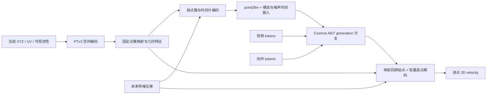

# 基于现有代码的 PTv3–Cosmos PointFlow 接入设计

日期：2026-09-08；实现进度更新：2026-09-09。数据接口、Sonata 几何编码、point codec 已分任务实现并完成 GPU smoke；任务 4 的序列与 attention 接线已实现，GPU 待验证。完整联合训练尚未接通。

实现说明：[任务 1](pointflow_task1_data_interface.md:1)、[任务 2](pointflow_task2_geometry.md:1)、[任务 3](pointflow_task3_codec.md:1)、[任务 4：序列与位置 attention](pointflow_task4_sequence_attention.md:1)。下文未标注已实现的后续训练机制仍为设计。

本次修订：用户已确认 head 相机固定。位置编码以固定 head 相机坐标系为基础，目标是通过 PointFlow 建立 video–action 桥接；第 7 节明确区分当前 Cosmos 行为、首版新增机制和后续增强。数学公式使用可渲染的 Markdown 块级公式。

数据更新：已检查用户新提供的 `datasets/sandwich_dense_fullseq_10_0298_20260908/outputs`，主数据源改为 dense full-sequence NPY；每帧有效点数不同，保留首帧查询 ID。旧 H5/1120 点描述仅对应历史兼容数据。详情见 [新数据检查与接入调整](pointflow_dense_fullseq_audit.md:1)。用户接受 H200 上约 50M 模型，PTv3 默认采用约 38.7M 的 encoder-only 联合训练。

时间窗口以当前 Cosmos 配方为唯一基准：15 Hz、33 帧观测、32 步动作；对应新 30 Hz dense 标签的 64 个原始间隔。取消此前为 LingBot H48 改为 25 帧视频的提议。PointFlow 本身也按 15 Hz 预测 32 步，不保留独立 30 Hz 密集监督；时间片从 Cosmos VAE 时间压缩推导，见第 4 节。

## 1. 推荐方案

以当前 Cosmos3-Edge-DROID 的 WAM 训练为基础，新增 **PointFlow generation 模态**：

1. 仅用预测起点可观测的点云运行 PTv3，得到几何特征和固定点簇映射。
2. 将未来带噪位移按“点簇 × 时间片”编码成 point tokens，经 `point2llm` 投影后加入 Cosmos generation 序列。
3. point、video、action 共享已有 MoT generation expert；video–point 用共享时间与图像位置，point–action 使用时间对齐且不引入虚假的图像空间对应，具体 attention 改动见第 7 节。
4. 从 point hidden states 经固定映射回传到原始点，用轻量逐点解码器输出每个未来时刻的 3D flow-matching velocity。
5. 训练和推理都保留这条分支；推理输入当前几何和未来噪声，联合生成视频、动作、点轨迹。

不需要额外的 learned Flow Query，也不增加第二套时空 Transformer 主干。PTv3 是空间编码器，Cosmos 是联合动力学主干，逐点 MLP 是输出解码器。

Track4World 继续作为离线轨迹标签生成器，不放入 Cosmos 主干。推理时起点点云由当前深度观测/深度估计或仅依赖历史的跟踪提供；PTv3 本身不能从 RGB 生成 XYZ。固定相机不代表离线重建天然无漂移，仍需校验轨迹参考系与尺度的一致性。

相比参考文档，关键补充是：**预测什么、如何加噪、如何从 pooled token 回到逐点轨迹、如何在推理时构造同样的 token**。仅把未来 GT 点云编码后拼进主干，会泄漏未来；仅接 `point2llm` 则还没有形成可采样的 PointFlow 模型。



## 2. 实际代码核对结果

下文 `C` 为本仓库根目录；`L` 为 `/mnt/shared-storage-gpfs2/ailab-eailabagent-gpfs/shichaojian/WorldAct-lingbot-va-pointflow/lingbot-va`；`P` 为同级 `PointTransformerV3`；`T` 为 `WorldAct-lingbot-va-pointflow/third_party/Track4World`。`路径:行号` 均对应本次检查的工作区。

| 事实 | 代码依据 | 设计影响 |
|---|---|---|
| 当前 Edge 使用 Nemotron MoT，hidden size 2048、28 层 | `C/cosmos_framework/configs/base/experiment/sft/models/edge_model_config.py:4`；`C/cosmos_framework/model/generator/reasoner/nemotron_3_dense_vl/configs/Nemotron-2B-Dense-VL.json:4` | 从模型配置读取维度，不照搬 Nano/Qwen 或 LingBot 维度 |
| video/action 已在 VFM 外壳中独立编码，再进入统一主干 | `C/cosmos_framework/model/generator/mot/cosmos3_vfm_network.py:689`、`:941` | 仿照 action 增加 point 模态；无需新增 MoT expert |
| 真正使用的 packing 类来自 `sequence.py`、`modality.py` | `C/cosmos_framework/data/generator/sequence_packing/__init__.py:5` | 不以同目录旧 `types.py` / `modalities.py` 为主修改入口 |
| 当前单右手数据是 27D，joint 模式为 7+20 关节 | `C/cosmos_framework/data/generator/action/datasets/singlerighthand_raw_dataset.py:185` | 数据适配器必须明确 joint action 语义，不能仅按维度判定 |
| 原始 30 Hz，Cosmos 配方取 15 Hz、32 个动作间隔和 33 张图 | `C/cosmos_framework/configs/base/experiment/action/posttrain_config/action_policy_singlerighthand_edge.py:78`；`C/cosmos_framework/data/generator/action/datasets/singlerighthand_raw_dataset.py:228` | 时间跨度 64 个原始帧间隔，与 H48 不同 |
| 拼图上方是 wrist，下方是 head | `C/cosmos_framework/data/generator/action/datasets/singlerighthand_raw_dataset.py:303` | head UV 映射到 Cosmos 时必须加入下方视图偏移 |
| PTv3 默认带 unpool decoder，`cls_mode=False` | `P/model.py:786`、`:966` | 获取压缩 token 应使用 encoder-only 或显式截取中间层 |
| PTv3 pooling 保存 parent/inverse，但没有自动传播 UV | `P/model.py:639`、`:681`、`:704` | 新增映射组合和 metadata 聚合，不能直接假定输出带 UV |
| LingBot 使用 learned future tokens 经过主干，再交给 PointFlowHead | `L/wan_va/modules/model.py:1277`、`:1395`；`L/wan_va/modules/pointflow.py:180` | 可借鉴标签与损失；当前分支不是参考文档的 PTv3 联合扩散 |
| Track4World `infer` 的 `flow_3d` 在此接口是绝对轨迹位置 | `T/track4world/nets/model.py:2313`；`L/tools/export_full_sequence_pointflow.py:190` | 训练位移要显式减去当前窗口的起点 XYZ |

### 已检查的数据与检查边界

入口为 `L/script/singlerighthand_pointflow/run_train_joint_mixed_pointflow_4gpu.sh:10`。它配对 sandwich/dropper 的 joint LeRobot 数据与对应 pointflow root，排除每个数据集 episode 0，且显式限制 chunk 模式。

实际只读抽样了 sandwich 的 `datasets/singlerighthand_sandwich_100_pointflow_s16_h48_v2/chunk-000/episode_000001.h5`：

- 该 root 有 101 个 episode H5；样本 `track/position=(117,49,1120,3)`，`track/valid=(117,49,1120)`。
- `query/uv_px`、`query/uv_norm` 均为 `(1120,2)`；28×40 查询网格，图像 640×448。
- attributes 为 `fps=30`、`length_unit=meter`、`coordinate_frame=fixed_head_camera_episode`。
- `global_id_rule=window_id * num_anchors + query_id`，不能跨 chunk 假定同一数组索引代表同一物理点。
- `training_horizon_steps` 属性仍是历史值 100，但实际源轨迹是 49 个状态。现有 loader 也明确兼容这种差异：`L/wan_va/dataset/pointflow_store.py:220`。

此前只核对了 full-sequence H5 的导出器和 loader，默认路径下未找到 H5。现已检查新 dense NPY 的全部 10 段元数据与数组 shape，并抽查大数组帧；完整范围、有效点统计、内参和尾段异常见 [检查报告](pointflow_dense_fullseq_audit.md:1)。这不是对全部 dense 数值的完整质量验证。

## 3. 数据契约：full-sequence 与 chunk 共用模型

新增 `PointFlowSource.read_window(dataset_id, episode_id, raw_start, horizon, target_fps)`，输出：

```text
dataset_id, episode_id, source_mode, coordinate_frame, length_unit
raw_start: int
raw_frame_ids: [H+1]                   # 15 Hz 目标对应的原始索引：r,r+2,...,r+64
target_fps: 15                        # 由 Cosmos 配置读取；H=32，source_fps=30
anchor_xyz: [N,3]                      # 固定 head 相机系，当前窗口起点，单位米
anchor_uv_px: [N,2]                    # 当前起点在 head 图像中的像素坐标
anchor_observed: [N]                   # 仅当前/历史可得的输入可观测性
point_ids: [N]                         # source 内稳定的对应关系
displacement_m: [H+1,N,3]              # X[raw_frame_ids[k],i] - X[raw_frame_ids[0],i]
target_valid: [H+1,N]                  # 只用于监督
source_image_hw, head_to_video_transform
camera_intrinsics, distortion_metadata # 可选；预测轨迹投影时必需匹配相机模型
video_raw_frame_ids, action_raw_frame_ids
```

`displacement_m[0]=0`；模型只生成 k=1…H。将固定零起点排除出噪声状态与 loss，不浪费模型容量学习恒等约束。

**dense full-sequence NPY（当前主格式）**：`position.npy=[T,448,640,3]`，`uv_px.npy=[T,448,640,2]`，`valid.npy=[T,448,640]`。首帧网格查询 ID 为 `y0*640+x0`，448×640 是查询槽位布局，不是各时刻点所在的像素布局。在起点 r 按当前有效性与几何筛选/采样 ID，得到变长 N；未来所有帧按同一组 ID gather，位移为 `position[raw_frame_ids[k],id]-position[r,id]`。不能每帧过滤后按新的数组序号相减。未来有效点数可以变化，但输入点集不依赖未来 mask。参考 `T/track4world/nets/model.py:1636`、`:2313`。

新数据为连续 30 Hz，无旧 H48 窗口限制；按当前 Cosmos 的 15 Hz 时间轴取 raw offsets 0、2、…、64，读取起点在内的 33 个轨迹状态，预测 H=32 步。当前有效点只代表首帧 query 中在 r 时刻可用的部分，不覆盖所有后续新显露表面。旧 1120 点、H5 格式标记和 once-lost 规则不得强加给这批数据。新 reader 的 mask/质量策略见 [检查报告](pointflow_dense_fullseq_audit.md:1)。

**full-sequence H5（兼容）**：读取 `global/position[raw_frame_ids]`、`global/valid`、`global/uv_px[r]`。起点是 `position[r]`；`global/xyz0` 是 episode 起点，不能拿它替代当前起点。依据：`L/wan_va/dataset/pointflow_store.py:441`、`:475`、`:521`；`L/tools/export_full_sequence_pointflow.py:403`。

**chunk**：读取一个完整 `track/position[w]` 与对应 anchor UV，只允许该 chunk 支持的原始起点与 raw_horizon≤48。禁止跨 chunk 拼接“同索引”的轨迹来凑长窗口。依据：`L/wan_va/dataset/pointflow_store.py:488`。

旧 chunk H48 不满足当前 Cosmos raw_horizon=64 的完整监督要求，主配方应拒绝该组合，不能裁短 Cosmos 窗口或重复末帧伪造 64 个 raw 间隔的覆盖。需要兼容时单独建立显式的部分监督实验；full-sequence H5 也必须检查实际 global 轨迹覆盖，而不是依赖旧 H48 属性。

当前 LingBot `load_action_aligned_windows()` 强制 K=4、每 latent 间隔 16 个原始帧；Cosmos 不应直接复用这段对齐逻辑，应仅复用 H5 校验、轨迹读取、重采样等纯数据功能（`L/wan_va/dataset/pointflow_store.py:331`）。

UV 一律先转回像素：chunk 是 `2*uv_px/[W-1,H-1]-1`，full-sequence loader 是 `uv_px/[W,H]`。在数据适配器内统一，再做图像几何变换，不能直接混用 norm 值（`L/wan_va/dataset/pointflow_store.py:484`；`L/wan_va/configs/va_singlerighthand_pointflow_cfg.py:27`）。

混合数据用显式 manifest 配对 `(dataset_id, episode_id, raw_episode, action_cache, pointflow_file, split)`。不要假定 Cosmos 原始 episode 名、LeRobot episode index、H5 文件名天然一致；利用 metadata 的 source episode 建映射并检查帧数/FPS。训练/验证按 episode 划分后再采窗口；归一化统计只用训练 split，full-sequence 单独重算，不能沿用包含所有 200 个训练候选 episode 的旧统计冒充无泄漏验证。

## 4. 时间对齐与首版窗口

按用户要求，保持当前 Cosmos 单右手 Edge 配方。新 PointFlow 数据、token 时间片、loss 和 eval 均适配 Cosmos，不反向修改其视频/action 窗口。

| 内容 | 首版选择 |
|---|---|
| 原始窗口 | raw r…r+64，共 64 个间隔，64/30≈2.133 s |
| Cosmos 视频 | r,r+2,…,r+64：33 帧，15 Hz |
| Cosmos 动作 | 32 步，当前 loader 的 action 源索引为 r,r+2,…,r+62；另有 1 个起点 state token，总输入 33 个 action/state tokens |
| VAE | 时间压缩 4，33=1+4×8，预期 9 个 latent 时间位置；需实际 encode 核验 |
| PointFlow 标签 | 取 raw offsets 0、2、…、64，共 33 个对齐状态；起点位移固定为零，只生成后续 32 个 15 Hz 位移，输出 [32,N,3] |
| point 时间片 | 每个 Cosmos latent 时间间隔覆盖 4 个 15 Hz 状态，因此 q=4，共 8 个未来时间片；物理跨度仍为 8 个 raw 间隔 |
| point token 布局 | 1 组 anchor-point + 8 组 noisy-point，与视频的 1+8 个 latent 时间位置对应 |

保留 `fps=15`、`chunk_length=32`、`tokenizer.encode_exact_durations=[33]`，不再提议改成 24/25。依据：`C/examples/toml/sft_config/action_policy_singlerighthand_edge.toml:5`；`C/cosmos_framework/configs/base/experiment/action/posttrain_config/action_policy_singlerighthand_edge.py:30`、`:77`；VAE 时间压缩见 `C/cosmos_framework/configs/base/experiment/sft/models/nano_model_config.py:110`。

video、pointflow 和 action 统一为 15 Hz。action 源索引、state 的条件属性与 MRoPE offset 沿用现有 SequencePlan：action 取 raw offsets 0、2、…、62，描述控制区间；point 未来状态取 2、4、…、64，描述相应的结果时刻。不能因两者都是 32 步就忽略区间起点/终点语义。

上述 q=4 是 point 分支的新增设计，依据 Cosmos VAE 的时间压缩 4 推导，不是现有 Cosmos 已有 point 配置。每片保留 4 个独立位移而非求平均。原始 30 Hz 文件保持不变，无需重新运行 Track4World；只在 reader 按 Cosmos 时间戳采样，训练、推理、eval 都不再输出/评估额外的中间 30 Hz 状态。

窗口长度由配置推导，不能另保留一个独立的 LingBot horizon 默认值：令视频间隔数为 A、raw/video FPS 比为 s、VAE 时间压缩为 c，则：

$$
H=A,\qquad H_{\mathrm{raw}}=A\,s,\qquad q=c,\qquad B=H/q=A/c
$$

当前 A=32、s=30/15=2、c=4，得到预测步数 H=32、原始跨度 H_raw=64、q=4、B=8。H 在本文其余 shape/loss/eval 中均指目标 15 Hz 步数，不能与原始跨度混用。实际适配器使用 raw frame IDs/timestamps 对齐，检查末帧覆盖与采样间隔；遇到非整数 FPS 比或不可整除长度，应显式重采样/定义尾片 mask，不能静默取整。将解析后的时间契约写入 run config、eval cases manifest 和 checkpoint 元信息。

full-sequence 是整集轨迹的存储和身份约定，**不等于把整集几千帧一次喂给 Cosmos**。训练仍按 Cosmos 窗口切片，训练和推理共同使用这份配置。

## 5. PTv3：固定起点几何与点簇

**预训练接入更新（2026-09-08）**：已接入官方 Sonata PTv3，并严格加载 `sonata_small.pth`（38,648,992 参数）。采用这份权重时，输入必须遵循 XYZ+RGB+normal 的 9 维契约，使用 checkpoint 的 `enc_mode=True` 配置；下面原版 `in_channels=3/6`、`cls_mode=True` 描述仅适用于原版随机初始化/对照分支。官方预处理平移坐标并体素采样，后续 PointFlow adapter 必须另外保留原始相机坐标、UV 和点 ID，不改变绝对 XYZ 编码与轨迹标签的参考系。源码、验证结果及尚待完成的真实数据适配见 [Sonata 环境验证](sonata_environment_validation.md:1)。

输入只使用起点 XYZ，RGB 可从同一 head 图像按 UV 采样作为可选特征。仅有 XYZ 时设 `in_channels=3`，不保留默认 6 却输入 3；首次验证可用 XYZ+RGB 的 6 维输入。依据：`P/model.py:789`。

按用户接受 H200 上约 50M 模型的决定，首选本地默认 encoder-only：channels `(32,64,128,256,512)`、depths `(2,2,2,6,2)`、`cls_mode=True`，约 38.7M 参数（默认 6 维输入，按层结构计算，未实测 GPU）。完整 encoder+decoder 约 46.2M，但 pooled token 接入不需要默认 decoder。端到端训练时在线计算几何特征；推理每个新观测计算一次，单轮去噪复用。缓存几何映射可以加速，只有冻结 PTv3 后才可长期缓存特征。

原先约 7M 的浅 encoder 作为性能消融。新 dense 数据可有二十多万个当前有效点，不能沿用 1120 点的成本判断；输入采样/voxel 预算、pooling 深度和最终 K 分别实测。若加载 PTv3 checkpoint，必须遵循其匹配的网络配置。

原始 metric XYZ 负责 voxelization；点特征可使用训练集固定尺度归一化。不要用每帧独立 min-max，也不要根据未来轨迹设空间尺度。为每个样本单独生成 `grid_coord`，避免默认 batch-wide `coord.min(0)` 让一个样本的离散边界受同 batch 其他样本影响（`P/model.py:93`）。同 voxel 重复点先做可追踪聚合，保留原始点到 voxel 的映射；空点云采用显式无几何分支。

目标 pooled token 数可先探索 128–256，但 **PTv3 不保证固定 K**，必须实测训练集 K 分布，再选择 voxel size、stage 或 token-budget 策略。不能用 attention `patch_size` 控制压缩率。允许每个样本 K 不同，通过 packer 处理。

组合每一级 `pooling_inverse`，得到 `c(i): original_point -> final_cluster`。所有时间片和整个去噪过程使用同一 c(i)，不对未来 GT 坐标或带噪坐标重新聚类。

UV、起点 XYZ 直接按最终 c(i) 对原始有效点聚合：

$$
C_j = \{i \mid c(i)=j,\; i\text{ 为起点有效点}\}, \qquad n_j = |C_j|
$$

$$
\overline{\mathbf{u}}_j = \frac{1}{n_j}\sum_{i\in C_j}\mathbf{u}_i,
\qquad
\overline{\mathbf{x}}_j = \frac{1}{n_j}\sum_{i\in C_j}\mathbf{x}_i
$$

其中 UV 为二维向量、XYZ 为三维向量，分别对每个坐标分量求平均。

若逐级聚合，需要携带原始点计数加权；逐级无权平均不是最终原始点均值。PTv3 默认 feature pooling 是 max，而 coord 是 mean，UV 不应跟随 feature 的 max 聚合（`P/model.py:681`）。

必须保留原始点局部特征、cluster 内相对 XYZ/UV 和映射，用于还原本窗口选中的 N 条轨迹；N 为变长，不固定为旧数据的 1120。仅把每个 cluster 的同一条预测广播给所有点，会丢失手指与物体接触处的差异。

## 6. Point token 与逐点解码

令归一化未来位移 `d = displacement_m[1:] * flow_scale`。噪声状态始终保存在原始逐点空间 `[H,N,3]`，不在有损 pooled latent 空间定义扩散。

时间片 b 包含 q=4 个对齐 Cosmos 15 Hz 的未来状态，按 Cosmos VAE 时间间隔推导。对于每个原始点：

```text
e[b,i] = MLP_flow(flatten(d_sigma[b*q:(b+1)*q,i]))    # 12 -> Dp; d_sigma excludes anchor
e[b,j] = mean_{c(i)=j}(e[b,i])
z[b,j] = point2llm(LN(concat(geometry[j], e[b,j])))
         + point_modality_embed + noise_time_embed(sigma)
```

其中 `geometry[j]` 包含 PTv3 局部特征和显式的相机系 XYZ 编码，具体见第 7 节。

另放 K 个仅由当前几何生成的 **anchor-point tokens**，不加扩散噪声，表示“起点在哪里”。上述随 sigma 更新的轨迹 tokens 称为 **noisy-point tokens**，表示“未来如何运动的当前带噪估计”。这是本方案定义的 token 类型，不是 Cosmos 已有名称；anchor token 的输入几何可缓存，但经过联合 attention 后的 hidden states 仍会更新。

首版总点 token 数为 `K*(1+H/q)=9K`；H=32、q=4、K=128–256 时为 1152–2304。K 仅是待验证预算，dense 数据可能需要更大 K 以保留细节。单独的 K 个 anchor tokens 是可消融选项。新数据若将所有 286720 查询槽位逐帧送入主干则为 33×286720=9461760，不能直接照搬。PTv3 输入点数 N 与进入 Cosmos 的点簇数 K 必须分开控制。

经过 Cosmos 后：

```text
h[b,j] = final_hidden[point_token_index[b,j]]
v[b,i] = MLP_decode(
    h[b,c(i)], local_geometry[i],
    anchor_xyz[i] - cluster_xyz[c(i)],
    anchor_uv[i] - cluster_uv[c(i)],
    flatten(d_sigma[b*q:(b+1)*q,i]), noise_time_embed(sigma)
)                                                           # output q*3
```

将 v reshape 回 `[H,N,3]`。这是有损空间汇聚后的条件解码，不声称 inverse mapping 能无损恢复被 pooling 丢掉的运动信息。逐点 noisy skip 与局部几何可减轻损失；若手部细节明显退化，优先减少 pooling、增加 cluster 内局部 decoder 或双尺度特征，再考虑新增复杂生成模块。首版不使用 28×40 Conv2d 邻接：full-sequence 的点随运动离开初始网格，索引邻接不再等同于当前空间邻接。

PTv3 可以在推理开始时缓存一次；训练 PTv3 时须在 GPU forward 内计算并保留梯度，不能在 DataLoader 或无梯度预处理里算完再声称端到端训练。带噪运动编码和 Cosmos 在每个采样步重算。

## 7. 位置编码：以 PointFlow 桥接 video 与 action

### 7.1 固定相机前提与三类信息

用户已确认相机固定。起点点云、未来轨迹和三维位移全部表达在同一个固定 head 相机坐标系，不引入逐帧相机运动补偿，也不要求先转换到世界坐标系：

$$
\mathbf d^{\mathrm{cam}}_{k,i}
=\mathbf X^{\mathrm{cam}}_{r+2k,i}-\mathbf X^{\mathrm{cam}}_{r,i}
$$

这里 k=1…32，是 15 Hz 目标步索引，r 为原始帧起点；一般实现使用 raw_frame_ids[k]，公式中的步长 2 来自当前 30/15 的 FPS 比。位移单位为米；第 8 节 RF 中的位移是乘以 `flow_scale` 后的模型空间数值。相机固定是物理前提，数据仍需保证每帧重建使用同一尺度和参考系。

video 输入主干前已经是 VAE latent 浮点特征，point/action 也投影为 hidden vectors。位置设计的关键不是整数或浮点数，而是坐标含义：

| 信息 | 来源 | 编码方式 | 作用位置 |
|---|---|---|---|
| 在图像哪里 | 当前点的 head UV | 图像变换后转连续 patch 坐标 | video–point 的 Q/K 空间 MRoPE |
| 在三维空间哪里 | 当前相机系 XYZ、点云邻接 | PTv3 xCPE + 显式 XYZ MLP | point token 内容；可选 point–point 几何 bias |
| 什么时候 | video/point/action 真实时间戳 | 共享时间 MRoPE | 跨模态 Q/K 时间位置 |
| 如何运动 | 起点相对的带噪未来位移 | 时间片轨迹 MLP | noisy-point token 内容 |
| 去噪到哪一步 | sigma | diffusion timestep embedding | noisy-point token 内容 |

当前 VFM 视频编码见 `C/cosmos_framework/model/generator/mot/cosmos3_vfm_network.py:567`。真实时间和扩散时间 sigma 不得混用，关节角和位移数值不能直接当作与视频行列比较的位置编号。

### 7.2 在图像哪里：UV 对齐视频 patch

保留 PTv3 xCPE。Cosmos 的空间 MRoPE 使用 head 投影到拼图后的高度、宽度，不用 3D XYZ 替代 h/w。实际变换链为：

```text
pointflow 640×448 坐标
 -> 原始 head 像素坐标（匹配实际 resize/crop 与像素中心约定）
 -> _compose_views 对 head 的 resize
 -> 加上 wrist 视图的高度偏移
 -> ActionTransformPipeline 的 resize / reflection padding
 -> VAE latent grid
 -> patchify 后的 token grid
```

来源：`C/cosmos_framework/data/generator/action/datasets/singlerighthand_raw_dataset.py:303`；`C/cosmos_framework/data/generator/action/transforms.py:362`、`:422`。默认 VAE 空间压缩 16、patch_spatial=2，近似每 32 个最终图像像素对应一个 patch，但实际实现应根据最终尺寸和 resize 元信息计算连续坐标，不能只用一个硬编码 32 忽略视图偏移与像素中心。

对原始起点有效点先计算 patch 坐标，再按第 5 节最终 cluster mapping 聚合：

$$
\bar h_j=\frac{1}{|C_j|}\sum_{i\in C_j}h_i,
\qquad
\bar w_j=\frac{1}{|C_j|}\sum_{i\in C_j}w_i
$$

坐标使用 float，不必量化到最近 patch；Edge MRoPE 在计算频率时会使用浮点 position IDs（`C/cosmos_framework/model/generator/reasoner/nemotron_3_dense_vl/nemotron_3_dense_vl.py:119`）。平均 UV 只是点簇代表位置，不保证落在某个真实物体表面；首版记录簇内 UV 分散程度，过大的空间簇应减少 pooling。

新 dense 数据直接取 `uv_px[r,y0,x0]`，不能用 `(x0,y0)` 替代当前 UV；后者仅标识首帧 query。现有 `intrinsics.npy` 是归一化内参，使用时先按推理图像 640×448 转换，再处理原始图像/拼图 resize；抽查投影自洽性见 [数据检查第 4 节](pointflow_dense_fullseq_audit.md:1)。

首版 anchor-point 和 noisy-point 都使用 **anchor UV**。对未来 token，它表示“起点在这里的点簇，在未来发生什么运动”，不声称这是未来物体的真实像素位置。相同 UV 使空间坐标可比较，不保证 attention 自动偏好最近位置，也不保证单凭位置编码就能学会桥接。

head XYZ 只对应 head 投影，不对应 wrist 像素。首版允许主干学习与 wrist 的语义联系，不宣称与 wrist 有显式几何对应；若添加局部几何 bias，仅作用于有可靠投影的 head 区域。

### 7.3 在三维空间哪里：局部结构与绝对位置同时保留

PTv3 从当前点云提取局部结构特征，但不依赖 xCPE 单独承担绝对相机位置。显式增加点簇中心 XYZ 的编码：

$$
\mathbf G_j
=W_F\mathbf F_j^{\mathrm{PTv3}}
+\operatorname{MLP}_{xyz}\left(\frac{\bar{\mathbf X}^{\mathrm{cam}}_j-\mathbf o}{s_{xyz}}\right)
$$

两项均投影到相同几何特征维度。$\mathbf o$ 首版取相机原点，$s_{xyz}$ 为训练集确定并保存的固定空间尺度；不要逐帧中心化或 min-max 导致绝对位置消失。该尺度可与位移 `flow_scale` 分开设置；投影时始终恢复到米。

XYZ MLP 是 token 内容编码；UV-MRoPE 是图像坐标关系，两者同时存在。解码器继续接收原始点相对簇中心的 XYZ/UV。未来如需要加强 point–point 几何关系，可加入起点相对 XYZ 的 attention bias，但首版先依赖 PTv3 和显式 XYZ 内容，不增加新的三维 RoPE 轴去替换预训练的视频轴。

### 7.4 什么时候如何运动：统一物理时间，保留片内轨迹

所有模态时间都由真实时间戳转换，复用现有 FPS modulation 的基准：

$$
t_{\mathrm{RoPE}} = t_{\mathrm{start}} + \Delta t\cdot\frac{f_{\mathrm{base}}}{c_{\mathrm{base}}}
$$

$t_{\mathrm{start}}$ 是该样本视频起点的 MRoPE 时间位置，$\Delta t$ 是目标时间相对视频起点的秒数；$f_{\mathrm{base}}$ 为基准 FPS，$c_{\mathrm{base}}$ 为基准时间压缩倍数。

当前视频配置基准为 24/4=6 个位置单位/秒。point 时间片的位置改为该 Cosmos latent 时间间隔的**右端点**，与现有视频 latent 时间索引对齐，取消此前独立四帧片的中心时间约定。anchor token 的 Δseconds=0。动作仍保持当前 action offset 规则并做对齐测试。来源：`C/cosmos_framework/data/generator/sequence_packing/mrope.py:148`；`C/cosmos_framework/data/generator/sequence_packing/sequence.py:341`。

例如第一片输出 raw offsets 2、4、6、8（目标步 1…4），代表位置用 8/30 秒；第二片输出 10、12、14、16，代表位置用 16/30 秒，最后一片为 58、60、62、64。连同 anchor，point 时间位置为 0、8/30、16/30、…、64/30 秒，MRoPE 相对偏移为 0、1.6、3.2、…、12.8，与当前视频 9 个 latent 的名义时间位置相同。代表位置不表示片内 4 个轨迹状态同时发生；片内有序输出和 decoder 的索引保留真实时间。VAE 的时间感受野也不等于单一原始帧。

运动内容先逐点编码，再做点簇聚合：

$$
\mathbf E_{b,j}
=\frac{1}{|C_j|}\sum_{i\in C_j}
\operatorname{MLP}_{motion}\left(
\operatorname{Concat}_{k\in I_b}\mathbf d_{\sigma,k,i}\right)
$$

每片四个三维位移按时间顺序串联，输入为 12 维，不将四帧平均为一个位移。最终 noisy-point 内容为：

$$
\mathbf z_{b,j}
=\operatorname{Point2LLM}\left(\operatorname{LN}([\mathbf G_j;\mathbf E_{b,j}])\right)
+\mathbf e_{\mathrm{point}}+\operatorname{TimeEmbed}(\sigma)
$$

另携带非规则浮点位置元数据：

$$
p_{b,j}=(t_b,\bar h_j,\bar w_j)
$$

输入数据、原始点数和 cluster mapping 仅由当前/历史观测决定，未来 valid/moving 不参与运动 token 的输入聚合权重。

### 7.5 Point–action 桥接：不能把空间零坐标当作“没有空间”

当前 action packer 使用 1×1 空间网格，空间重置时对应 `(t,0,0)`（`C/cosmos_framework/data/generator/sequence_packing/sequence.py:399`）。这是已有 checkpoint 的编码约定，**不表示 spatial RoPE 被关闭**：它与 `(t,h,w)` 的 point 计算 Q/K 点积时仍有空间相位差。

一个 action token 表达整个 27D 关节向量，没有唯一的图像像素位置。修订后的首版方案：保留原 video–video、video–action、action–action 路径的位置规则，新增 point 相关关系按以下规则处理。

| token 对 | 首版位置关系 |
|---|---|
| video–point | 时间 + 图像 h/w 的 MRoPE，双向相同规则 |
| point–point | 时间 + anchor h/w；三维结构来自 PTv3/XYZ 内容 |
| action–point | 仅引入时间旋转，空间通道保留未旋转的内容点积 |
| text/understanding 与其他 token | 保留原 Cosmos 路径，首版不改变其位置规则 |

一种明确的 score 定义如下。把 Q/K 的通道按现有 MRoPE 频率分配区分为时间部分 T、空间部分 S 和未旋转部分 U（实际 Edge 是交错布局，不能假定连续切片）：

$$
s_{ij}^{A,P}
=\frac{
\langle R_T(t_i)q_i^T,R_T(t_j)k_j^T\rangle
+\langle q_i^S,k_j^S\rangle
+\langle q_i^U,k_j^U\rangle
}{\sqrt{d_{\mathrm{head}}}}
$$

没有未旋转部分时省略 U 项。video–point 的 S 项则使用各自 h/w 旋转后的点积。这样 action–point 不比较虚假的图像坐标，但仍保留全部通道的内容信息。物理时间同步和监督让模型学习“关节动作对应哪些三维变化”；这属于学习式桥接，不是已知的机械因果映射。

这需要新增 attention 机制，**不能仅靠修改 `position_ids` 实现**：同一个 point Q/K 在 video–point 与 action–point 中需要不同的空间处理。实现应保存旋转前 Q/K 或生成两套视图，按模态对选择 score，同时对每个 query 的全部合法 key 做统一 softmax。若分块调用 attention，必须用 log-sum-exp 正确合并，不能将分别归一化的输出直接相加。现有调度入口为 `C/cosmos_framework/model/generator/mot/attention.py:113`；RoPE 实现见 `C/cosmos_framework/model/generator/reasoner/nemotron_3_dense_vl/nemotron_3_dense_vl.py:31`。

为降低首次接入风险，可先跑“所有模态沿用现有 MRoPE”的对照版本，但应标记 `legacy_mrope`，不能把它当作上述桥接机制已经实现。完整首版增加 `pairwise_point_mrope` 模式，先做小规模正确性与性能验证；不改变 MoT expert 数量或现有理解/生成 split。

若以后有可靠 FK 和相机到机器人基座的外参，可增加更明确的空间桥接：

$$
\mathbf X_{\mathrm{tip},\ell}^{\mathrm{cam}}
=R_{\mathrm{cam}\leftarrow\mathrm{base}}
\operatorname{FK}_{\ell}(\mathbf q_{\mathrm{current}})
+\mathbf t_{\mathrm{cam}\leftarrow\mathrm{base}},
\qquad
\mathbf r_{i,\ell}=\mathbf X_i^{\mathrm{cam}}-\mathbf X_{\mathrm{tip},\ell}^{\mathrm{cam}}
$$

相机固定不意味着已知外参。当前首版不假定具备该标定，保留整向量 action token；后续可将点到多个当前执行部位的相对位置编码为附加特征，若拆分 action 为部位 token 则需另行设计。固定安装关系下外参可复用，不使用真实未来关节状态来生成推理不可得的空间条件。

### 7.6 后续增强：用预测轨迹更新未来图像对应

首版固定 anchor UV；有匹配的内参后，可以从模型预测的干净位移更新投影，而不是直接投影高噪声的扩散状态：

$$
\widehat{\mathbf d}_{\mathrm{clean}}
=\mathbf d_{\sigma}-\sigma\widehat{\mathbf v},
\qquad
\widehat{\mathbf X}^{\mathrm{cam}}_{k,i}
=\mathbf X^{\mathrm{cam}}_{r,i}
+\frac{\widehat{\mathbf d}_{\mathrm{clean},k,i}}{\mathrm{flow\_scale}}
$$

在匹配的去畸变针孔相机模型中：

$$
\widehat u_{k,i}=f_x\frac{\widehat x_{k,i}}{\widehat z_{k,i}}+c_x,
\qquad
\widehat v_{k,i}=f_y\frac{\widehat y_{k,i}}{\widehat z_{k,i}}+c_y
$$

随后沿同一 UV→拼图→patch 变换链得到位置。不需要机器人外参，但需要可靠相机内参；若图像未去畸变，应使用对应的畸变投影模型。不能假定“簇中心的投影”等于“成员投影的平均”。

这是第二阶段实验：使用上一次去噪步的预测或明确的两次 forward 协议，避免同一次 forward 中先要位置又先要预测的循环依赖。高噪声、负深度、出界或不可信投影回退到 anchor UV；训练需要模拟同样的预测反馈策略，而非用 GT future UV 替代。首版不启用动态重聚类、动态点数或动态 GT mask。

补充后续改进（保留）：在 chunk 维度可选固定 `K_max` 上限，后续版本可用 `point_active_mask` 做 padding + attention/loss 有效性联合屏蔽。该方案要求 packer、sequence、attention 与 decode 指标链路共享同一 mask，不改变当前“固定首帧 anchor + 变长 K_b”的一版设计。

### 7.7 实施边界

增加接收非规则 `(3,L_point)` 浮点 position_ids 的 point pack 方法，不能把点簇伪装成矩形 `grid_h×grid_w`。初版关闭几何 crop/flip 增强；后续启用时同步变换 UV、相机内参及有效性，不能只增强 video。

数据接口保存 camera frame/unit、原始 UV 图像尺寸、head→video 变换、时间戳、cluster mapping。内参/畸变参数为动态投影扩展预留；FK/机器人外参为显式运动学桥接预留。第一阶段采用固定 anchor UV + PTv3/XYZ 内容 + 共享真实时间 + action–point 的时间旋转 score；动态投影和机器人几何 bias 均为后续选项。

## 8. 噪声、loss 与防泄漏

**按 Cosmos 现有实现统一方向**：

$$
\mathbf{d}_{\sigma} = (1-\sigma)\mathbf{d} + \sigma\boldsymbol{\epsilon},
\qquad \boldsymbol{\epsilon}\sim\mathcal{N}(\mathbf{0},\mathbf{I})
$$

$$
\mathbf{v}^{*} = \boldsymbol{\epsilon}-\mathbf{d},
\qquad \sigma:1\longrightarrow0
$$

$\mathbf{d}$ 是归一化后的真实未来位移，$\boldsymbol{\epsilon}$ 是同形状的标准高斯噪声，$\sigma\in[0,1]$ 是噪声比例。采样从 $\sigma=1$ 的纯噪声逐步走向 $\sigma=0$ 的干净位移。

LingBot 的变量是 `tau:0→1`、target=`d-epsilon`；迁移时满足 `sigma=1-tau`、`v_cosmos=-v_lingbot`。尤其 Cosmos `RectifiedFlow.get_interpolation` 的 docstring 与实际公式存在方向表述差异，应以执行代码为准（`C/cosmos_framework/model/generator/diffusion/rectified_flow.py:206`；`L/wan_va/train.py:663`）。

首版 point 和 action 共用一个每样本 sigma，并保持与现有联合视频训练的 schedule 一致，避免主干训练时利用更干净的 GT point 去预测高噪声 action，推理却全部从噪声开始。可后续消融独立 schedule；不要直接拷贝 LingBot 辅助头独立 Beta 采样作为默认。

$$
\mathcal{L}_{\mathrm{point}} =
\frac{\displaystyle\sum_{k,i}m_{ki}w_i\left\|\widehat{\mathbf{v}}_{ki}-\mathbf{v}^{*}_{ki}\right\|_2^2}
{\displaystyle 3\sum_{k,i}m_{ki}w_i+\varepsilon_{\mathrm{num}}}
$$

$$
\mathcal{L}_{\mathrm{total}} = \mathcal{L}_{\mathrm{Cosmos,existing}} + \lambda_p\mathcal{L}_{\mathrm{point}}
$$

$k$ 是未来时间步，$i$ 是原始点索引；$m_{ki}$ 是监督有效性，$w_i$ 控制移动点和静态点的权重，$\widehat{\mathbf{v}}$ 是预测速度，$\mathbf{v}^{*}$ 是目标速度。分母中的 3 对应 XYZ 三个坐标分量；$\varepsilon_{\mathrm{num}}$ 是防止除零的小常数，与高斯噪声 $\boldsymbol{\epsilon}$ 不同。

保持原视频/action 权重语义，单独实现具有 `[H,N]` 有效性权重的 point loss，而非伪装成 action-channel mask。FP32 累计误差和分母。建议每个有效窗口归一化后按有效样本平均，明确分布式梯度归一化规则，避免 K/N 或空窗口数量改变模态权重。

旧 LingBot loader 用最大位移≥2 mm、有效步数≥20 定义 moving（`L/wan_va/dataset/pointflow_store.py:516`）。当前 15 Hz、H=32 的分组改用第 11.4 节版本化的有效比例规则，不沿用固定 20 步。训练可为明确 static 的点设置小权重，例如 0.05，作为待消融参数；moving 和 motion_unknown 均保留正常权重，避免低覆盖点被误当作静止。`lambda_p` 用 warmup 从 0 增长，结合梯度范数调节，不直接继承另一模型的绝对 loss weight。

必须区分以下两类 mask：

- **输入侧**：当前帧/历史可观测性、真实 padding，可决定 PTv3 点集和 token 数。
- **监督侧**：未来 valid、moving、event、static_background，只进入 target 清洗、loss 或指标；不得决定输入 token 数、cluster、位置或主干 attention mask。

非法 target 的 NaN 在加噪前替换为有限值并在 loss 屏蔽，不能寄望 `NaN*0=0`；保持输入侧固定点集，允许无标签位置有有限的 dummy noise payload。全无有效监督窗口返回连图的零 point loss，训练主体仍处理 video/action。依据：`L/wan_va/train.py:624`、`:874`。

还需审计**离线几何本身**：full-sequence 导出器利用整段序列估计几何和静态点（`L/tools/export_full_sequence_pointflow.py:237`、`:249`）。部署所需 `anchor_xyz/uv/observed` 应来自当前帧深度/历史因果跟踪，离线全序列输出主要作为监督。第一阶段可用离线 anchor 做 oracle 实验，但必须标注，不能将其结果等同于在线策略效果。

## 9. Attention、采样与工程接入

首版沿用现有非 temporal-causal WAM：文本/理解分支 + 单一 full-attention generation 区域，在 generation 内放 video、action、anchor-point、noisy-point。新增模态不意味着新增第三个 attention split。point 索引必须加入当前名为 `vision_sequence_indexes` 的 generation 索引集合；该变量实际上已经包含 action/sound（`C/cosmos_framework/model/generator/mot/cosmos3_vfm_network.py:950`）。

“单一 generation 区域”指 token 可见性和 expert 路由，不代表所有 token 对使用同一种空间位置规则。第 7.5 节的 score 按模态对选择旋转方式，须在该区域统一归一化；新增 per-token modality IDs 并随 packing、padding、索引排序保持一致。

先限制 `context_parallel=1`、`video_temporal_causal=False`、不开跨步 KV cache。现有 temporal-causal layout 有固定 `action_count+H_p*W_p` supertoken 假设，不能只拼 token 就开启（`C/cosmos_framework/data/generator/sequence_packing/sequence.py:98`）。后续再设计逐时间块的 point causal spans。

采样联合状态改为 `[video | action | point_displacement]`：保存每样本各模态的 shape 和 offset，同步扩展初始化、velocity 拆分/拼接、CFG、结果还原。所有这些位置当前均显式处理 vision/action/sound，不能只改训练 forward。来源：`C/cosmos_framework/model/generator/omni_mot_model.py:2085`、`:2137`、`:2447`。

初版 CFG 默认保持几何条件在正负分支一致；文本 dropout 继承现有策略。point velocity 的 guidance 先设为 1 作为明确基线，不机械套用视频 guidance。几何缺失时若需继续预测 action，应训练对应的 missing-geometry/token-dropout 模式；仅在推理删除 point tokens 会产生分布变化。

模型推理结果输出 `anchor_xyz_m + displacement_m`、point IDs、timestamps。GT `target_valid` 只可用于离线评估。若产品需要预测可见性，可另加有效性分类头，首版没有该头时不能把 GT 可见性当作预测置信度。

### 需要修改的位置

| 层 | 实施位置与内容 |
|---|---|
| 数据源 | 新建 `data/generator/action/datasets/pointflow_source.py`；解耦 LingBot K=4 逻辑；新增 mixed manifest dataset 或 wrapper |
| 样本变换 | `data/generator/action/datasets/singlerighthand_raw_dataset.py:363`、`data/generator/action/transforms.py:422`；保留原始帧索引、point 字段、视图变换 |
| 训练输入 | `model/generator/utils/data_and_condition.py:16`、`:56`；增加 point clean/noised/target 与元数据；更新 `omni_mot_model.py:3408` |
| 序列规划 | `data/generator/sequence_packing/sequence.py:29`、`:860`、`:977`；增加 point builder、spans、finalize、to_cuda、has_point；更新 `packers.py:40` |
| PTv3 | vendor 必要 model/serialization，保留许可证；新建训练模型侧 adapter；扩展 UV、count、inverse mapping |
| 模型头 | `model/generator/mot/cosmos3_vfm_network.py:108`；新增 PTv3、point 编解码、modality embedding、init_weights、encode/decode、gen index 路由 |
| 位置与 attention | `data/generator/sequence_packing/mrope.py:75`、`model/generator/mot/attention.py:113`；增加连续 point 坐标、modality IDs、旋转前 Q/K 和按模态对选择的空间规则；配置 `legacy_mrope` / `pairwise_point_mrope` |
| 损失与噪声 | `model/generator/omni_mot_model.py:1139`、`:1486`、`:1689`、`:4265`；point schedule、mask loss、noised replacement、输出转发 |
| 采样 | `model/generator/omni_mot_model.py:2085`、`:2447`、`:3068`；扩展 sample slicing 与联合 ODE 状态 |
| 优化器与 checkpoint | 新建 Edge-pointflow 实验；在 `keys_to_select` 加全部 point 参数；只在基座 warm start 跳过新增 keys，resume 必须恢复 point 和 optimizer/EMA |
| 并行与编译 | `model/generator/mot/parallelize_vfm_network.py:13`、`:78`；PTv3 sparse 运算先 eager，确认根 FSDP materialization/init/state_dict；不要直接 whole-graph compile |
| TOML | 扩展 `configs/toml_config/sft_config.py` 和底层 model config；增加点模态开关、路径、归一化、horizon、PTv3 与 loss 配置，再加配对 launch shell |
| 推理产品 | 请求参数和输出适配放 `cosmos_framework/inference/`；独立接受几何和时间戳，不从 inference 导入训练 dataset、optimizer 或 H5 loader |
| 训练评估与媒体 | 新增 `callbacks/pointflow_eval.py`、`evaluation/pointflow/`；注册训练开始/optimizer-step 回调、固定 held-out 案例、联合采样、指标、RGB/轨迹/action 可视化和 W&B 同 run 日志；详细要求见第 11 节 |

上表省略的前缀为 `cosmos_framework/`。训练数据与训练基础设施留在 inference 之外；可共享的数学/网络组件放中立模块，不将训练入口导入在线服务。

一个工程顺序问题：PTv3 的 K 通常要在 GPU 几何编码后才知道，而 packer 要先知道序列长度。建议把**不依赖学习参数的 voxel/cluster topology** 提前生成并传入 batch，GPU PTv3 使用同一 topology 并断言一致；或者先在 GPU 做轻量 topology preparation，再 packing，正式 PTv3 feature 编码仍在网络 forward 内。不能为了得 K 提前无梯度执行整个可训练 PTv3，也不能 pack 后悄悄改变 K。

PTv3 本地代码依赖 `spconv.pytorch`、`torch_scatter`、`addict`、`timm`，FlashAttention 为可选导入（`P/model.py:9`）。本次未验证其与 Cosmos 环境的 CUDA/ABI 兼容性。依赖作为 pointflow 可选组、按开关导入，先做最小 GPU forward/backward，再接 FSDP；不将整个 Track4World 及其深度模型放入 Cosmos 训练依赖。

## 10. 实施阶段与验收

1. **数据与几何基线**：完成 manifest、Cosmos 33-frame/32-action/32-point-step、15 Hz 统一时间契约（原始跨度 64 帧间隔）、UV overlay、dense adapter，统计有效点与 K 分布。校验 q=4 与 9 个 latent 时间位置；旧 H48 chunk 不能进入主配方伪装完整标签。
2. **局部正确性**：合成点云检验跨样本隔离、重复 voxel、最终 inverse composition、加权 UV、逐点恢复顺序和四帧 patch 顺序。PTv3+decoder 做小样本可学习性实验，判断 pooling 是否过度。
3. **Cosmos 联合训练 smoke**：接 point spans、generation routing、noise/loss 和参数初始化。point 开关关闭时原模型输出保持一致；打开时确认 point 参数实际在 optimizer 中、有梯度，基座 action heads 未被重置。
4. **采样闭环**：用已知常速度轨迹验证 RF 的符号、端点和单位还原；从纯噪声采样，不能以 teacher-forced velocity loss 代替轨迹生成评估。
5. **小数据过拟合后再扩展**：先固定少量窗口验证，再用 episode split 比较 action-only 基线、几何条件无 flow loss、完整联合 PointFlow 三组；之后尝试 K、时间片长度、loss weight 与真实在线几何输入。

必要验收包括：

- 修改 GT future UV、moving 或 event，不得改变 cluster、token 数、position IDs；替换未来标签不影响 sigma=1 时给定噪声的模型输入。
- 变长 K、N、空点云、全无监督点、mixed sample、NaN、chunk 边界都有明确行为；padding 不参与监督。
- UV overlay 应落在下方 head view 的真实目标像素，不能只检查数值范围。
- 物理时间与 sigma 分开测试；同一秒的不同采样率产生一致时间坐标，action 的 state/控制区间 offset 与 point 时间片右端点均有明确映射；核对 raw offset 64 的 point、视频末端时间一致。
- 固定 Q/K 内容、只平移 point 的 h/w：`pairwise_point_mrope` 下 action–point score 不变，video–point score 按空间规则变化；测试针对位置算子，不要求端到端 hidden states 不变。
- 按模态对计算的 attention 与小规模 dense reference 对照，验证统一 softmax、双向规则、交错 MRoPE 通道、sample 隔离和 padding；不要以可运行代替 score 正确性。
- XYZ 使用固定相机坐标系和固定尺度；当前几何的合法绝对平移应改变 XYZ 内容，而相对结构保持对应。投影扩展另测单位还原、已知内参、图像变换与无效深度回退。
- 分开报告移动点/静态点的 ADE、FDE、逐时间 EPE（毫米）、valid 覆盖率，以及动作误差、视频质量、显存与每步耗时。
- point loss 不应只降低自身误差而明显破坏 action；保存/恢复后 point、EMA、optimizer、normalization 及采样行为一致。
- 模型推理不读取未来 H5 标签；在线几何与 offline oracle 分别报告。

## 11. 训练中 Eval 与 W&B 可视化

这是训练方案的必需部分：训练开始记录基线，之后按完成的 optimizer step 周期采样，在同一个 W&B run 展示固定验证案例与数值变化。当前仅完成设计，以下 Cosmos 模块和配置尚未实现。

### 11.1 LingBot 参考实现及适用边界

| 参考位置 | 已有行为 | Cosmos 采用方式 |
|---|---|---|
| `L/wan_va/validation/split.py:12` | 按 episode 划分并保存 manifest，复用时校验成员 | 沿用机制，适配新 dense episode 名，先 split 再采窗口 |
| `L/wan_va/validation/split.py:73` | 固定、跨任务/episode 轮询选择案例 | 保存稳定 case ID、窗口起点与采样 seed |
| `L/wan_va/validation/hooks.py:18` | 保护 RNG、逐模块 train/eval 状态、attention 缓存状态 | 加入 PTv3、EMA、几何与噪声缓存的恢复 |
| `L/wan_va/validation/hooks.py:54` | clean GT video/action + 独立噪声 PointFlow | 仅作为可选 `val_head` 诊断；不作为部署式成绩 |
| `L/wan_va/validation/hooks.py:133` | 起始/周期验证，所有 rank 同步采样、rank 0 生成媒体 | 采用相同分布式原则，联合采样每步都执行 Cosmos |
| `L/wan_va/validation/visualize.py:147` | all/moving/static ADE、FDE | 扩展变长 N、数据失效、预测失败与覆盖率统计 |
| `L/wan_va/validation/hooks.py:281` | W&B Image、Video、Table | 沿用展示方式，增加预测视频与关节曲线 |
| `L/wan_va/validation/hooks.py:306` | `val_rollout` 接口仍抛 NotImplementedError | 不宣称已有闭环评估能力 |

原实现说明见 `L/README_POINTFLOW_VAL_HEAD.md:1`。它的固定少量案例是 case mean，不是完整验证集成绩；其旧统计仍可能包含 held-out episode。Cosmos 新实验使用 train-only 统计；若从见过验证集的 checkpoint 启动，必须在 metadata 标明历史数据暴露，不能靠重新 split 消除。

### 11.2 主要评估与诊断评估分开

**必需的 `val_joint`：单窗口、与目标推理条件一致的联合采样。** 输入任务文本、当前/允许的历史视频、当前 state、当前 anchor XYZ/UV；未来 video/action/pointflow 从固定噪声开始联合生成。GT future video、action、position、UV、valid 只进入指标与渲染，不进入模型条件或 token 选择。若当前只能使用全序列 tracker 的离线 anchor，标记 `geometry_source=offline_oracle`；有因果几何来源后使用 `geometry_source=causal_observation`，两者不能混报。

**可选的 `val_head`：干净 GT video/action 条件下的 PointFlow 诊断。** 目的是定位几何编码/解码和轨迹生成问题，所有图表明确标注 `clean_gt_video_action`。Cosmos 是联合去噪结构，不能照搬 LingBot “一次主干 + 多次独立 head” 的实现，仍需在每个 point 去噪步正确执行联合网络。如果训练没有覆盖此条件组合，成绩仅作额外诊断，不作为主指标。

**后续的 `val_rollout`：多窗口因果预测/实际策略评估。** 需要历史更新、新观测、点集重新选择及部署数据链路。离线单窗口的 ADE、动作误差不能当作机器人闭环成功率。首版不实现时不产出此 namespace 的成绩。

训练中的 RF loss 可以额外记录到 `val_loss/*`，但不能代替从纯噪声采样得到的 `val_joint/*`。

### 11.3 固定数据划分与案例

- 原始 episode 级 split，保证同一段视频所有重叠窗口只属于一个集合。新批次只有 10 个 sandwich episode，建议开发阶段固定 8 train / 2 val；这是小样本验证，不是最终泛化结论。未来混合任务时按任务分层留出。不要沿用 LingBot 的每任务 ep1..10 选择逻辑。
- split manifest 保存数据根、episode 名、任务、数据版本、训练/验证成员和 seed；已有 manifest 优先，成员变化要求显式创建新的评估版本。保存 train-only action/point 归一化统计版本与 hash。
- 周期展示默认 2 个固定案例，来自两个验证 episode；根据固定时间位置挑窗口，并在首次创建时记录质量可用性。后续评估不根据模型误差换案例。另建立较大固定窗口列表，每 1000 step 做覆盖更广的数值评估；若限制窗口数，应明确记录范围，不命名为 full-val。
- 每个 case 保存 `dataset_id/episode_id/raw_start/H/frame_ids`、点采样 seed、完整 selected query IDs 或 ID 文件及 hash、输入点数 N、PTv3 配置、sampler/steps/guidance、RGB 路径与几何来源。起点 ID 选择仅依赖当前观测；同一 case 在不同 checkpoint 使用相同 ID 和噪声。
- H、q 和末端时间从当前 Cosmos 配置解析：本配方 H=32、q=4，FDE 评估第 32 个目标步（第 64 个 raw 间隔），action 评估 32 步。train/eval/inference 不分别维护 horizon 默认值，改变 Cosmos 窗口后要更新 cases manifest 版本。
- 可视化仅画固定约 96 条轨迹，指标用该 case 的全部选定 N 个点。不得把“绘图点数 96”或“模型输入采样 N”与原始 286720 槽位混淆；未覆盖的原始点不计入该预测的准确率分母。
- 新数据的 6 段全无效尾段单独统计。没有未来监督的案例状态为 `no_gt`，ADE/FDE 缺失，不写成 0；若有 anchor 可仍检查推理是否有限。若 anchor 为空，使用设计中的 missing-geometry 分支，未支持时显式记录为不可评估，不重复随机抽取到“好案例”为止。

原始 RGB 优先来自新数据 `COMPLETE.json` 的 video 路径或经过校验的 manifest 映射，帧号使用 `frame_indices.npy` / `timestamps_sec.npy`；禁止按目录排序猜对应视频。固定查询 ID、输入/指标子集以及质量筛选规则必须可回放。

### 11.4 指标与分母

对每个 case 先恢复米制位移。只用 GT 的有效性和质量条件确定监督 mask，不能用预测出界/预测置信度过滤掉误差较大的点：

$$
e_{k,i}=1000\left\|\widehat{\mathbf d}_{k,i}-\mathbf d_{k,i}\right\|_2
$$

$$
\operatorname{ADE}_{mm}
=\frac{\sum_{k=1}^{H}\sum_i m_{k,i}e_{k,i}}
{\sum_{k=1}^{H}\sum_i m_{k,i}},
\qquad
\operatorname{FDE}_{mm}
=\frac{\sum_i m_{H,i}e_{H,i}}{\sum_i m_{H,i}}
$$

分母为 0 时输出缺失状态与计数，不填 0；FDE 永远指配置的终点 H，不能用最后一个有效时间步替代。GT mask 包含 valid、有限值和适用的正深度检查；mask 无效的数据先清洗再做算术，防止 NaN 传播。

| W&B key（主前缀 `val_joint/`） | 定义 |
|---|---|
| `{all,moving,static}_ade_mm` / `*_fde_mm` | 各组每 case 指标，再按有效 case 平均；附各自 case_count / valid_point_time_count |
| `epe_by_time` | 按真实未来秒数绘制 3D EPE 曲线；附每时刻有效点数 |
| `gt_valid_fraction` / `no_gt_case_count` | 标签覆盖，不能被预测质量指标取代 |
| `input_point_count` / `pooled_token_count` / `query_coverage` | N、K 与输入占原始查询槽位的比例 |
| `pred_nonfinite_fraction` / `failed_case_count` | 预测数值异常；含非有限预测的监督案例标记失败，不能静默过滤后算“正常 ADE” |
| `pred_outside_fraction` | GT 可评估点中预测负深度、不可投影或出画比例；不改变 3D 指标分母 |
| `gt_reprojection_p50_px` / `gt_reprojection_p95_px` | 用已存内参投影 GT XYZ 与原生 UV 比较，诊断标签/坐标链路 |
| `action_arm_mae_rad` / `action_hand_mae_rad` | 反归一化后 7 个 arm、20 个 hand 关节误差，确认缓存单位为弧度；排除 state 与 padded channels |
| `eval_seconds` / `peak_memory_gib` | 评估成本，避免验证长时间拖慢训练 |

moving/static 分组只用于指标和绘图。15 Hz、H=32 首版暂定最大有效位移阈值 2 mm、有效未来状态比例至少 0.4（32 步时至少 13 步），作为待验证的评估超参保存到 metadata；不再直接继承 LingBot 固定“20 步”的 H48 规则。可用但不足覆盖的点标记 motion_unknown，不归为静态；all 指标仍覆盖所有有标签点。H 改变时由覆盖比例重新推导计数，并版本化该定义。

无效预测案例在 JSON/Table 中显示失败状态；有限案例均值必须同时显示失败数，不能拿它与无失败结果直接比较。不会对 GT 有效但预测出画的点重新筛选“更好看的”绘图/指标 ID。

固定 2 个媒体案例的均值标记 `metric_scope=fixed_cases`；较大验证列表使用 `val_joint_sweep/*`。不同 N 的 case 默认等权，另可记录 point-weighted 指标，但命名区分。多 rank 对同一 case 的重复计算不重复计入样本数。

### 11.5 W&B 展示内容与 dense 数据投影

| 媒体 key | 展示内容 |
|---|---|
| `val_joint/comparison` | 三列 GT 轨迹、预测轨迹、叠加；当前 H=32 显示目标步 0/8/16/24/32，即 raw offsets 0/16/32/48/64，全部落在 Cosmos 视频时间轴上，GT 绿色、预测紫色 |
| `val_joint/trajectory_video` | 原始未来 head RGB 上的 GT/预测短尾迹 GIF，遮挡/无效处断线，不连接跨越无效区间的轨迹 |
| `val_joint/error_map` | anchor RGB 上的每点 ADE，固定 0–50 mm 色标；超范围标记饱和，无有效未来监督的点用灰色 |
| `val_joint/video_comparison` | GT 与生成视频并排，明确 wrist/head 布局；这是视频生成输出，不与“在 GT RGB 上画预测轨迹”混淆 |
| `val_joint/action_curves` | 7 个 arm 和 20 个 hand 关节分面绘制 GT/预测随时间曲线，使用反归一化单位与实际控制时间 |
| `val_joint/cases` | W&B Table，包含 step、case ID、任务、raw_start、N/K、几何来源、EMA/reg、sampler、指标、状态及媒体 |

借鉴 `L/wan_va/validation/visualize.py:166` 和 `L/wan_va/validation/hooks.py:281` 的 Image/Video/Table 组织方式。媒体固定显示 ID 与颜色；可根据 GT moving 标签挑固定展示子集，但只影响可视化，不能反向影响模型输入和指标点集。未来监督仅在推理完成后的 CPU renderer/metrics 可见。

**不复制旧 chunk 的投影校准流程。** LingBot 旧可视化会读取逐状态 Sim(3) alignment，并从 GT 拟合相机（`L/wan_va/validation/visualize.py:73`）。新 dense full-sequence 已提供原生 `uv_px.npy` 和归一化 `intrinsics.npy`：

- GT 轨迹直接使用 `uv_px[raw_frame_ids[k], query_id]`。
- 预测位移恢复米制后加 anchor XYZ，使用存储内参投影；先做 `K_px=diag(640,448,1)*K_norm`，再使用像素中心一致的 resize 映射到原始 640×480 head RGB。
- 不使用未来 GT 对应关系重新拟合预测投影，不对预测做逐帧 GT 对齐，不将模型估计 c2w 的抖动当成真实相机运动。
- PTv3 pooled UV 只用于模型位置编码；可视化逐点轨迹使用原始 ID 对应的 UV，不把所有点画到簇中心。
- head 轨迹与 Cosmos 拼图展示分别应用相应的图像变换。若追加预测视频上的轨迹叠图，应明确底图是生成视频，不把视觉一致性当作 GT 重投影误差。

媒体统一按 Cosmos 15 Hz 时间轴显示 raw offsets 0、2、…、64，共 33 帧，point 预测、GT 与媒体使用同一组目标时间，指标使用 32 个 15 Hz 未来状态，不再评估 raw 奇数帧的中间位移。GIF/视频保留实际时间戳，首末观测间隔为 64/30 秒；不要把每帧播放驻留时长误认为额外预测跨度。渲染错误可回放本地 record，不能悄悄改用别的投影公式掩盖错误。

### 11.6 训练回调、FSDP 和状态恢复

新增 `PointFlowEvalCallback`，首版在训练开始与 `on_training_step_end` 中统一调度固定案例评估，不同时注册另一套重复触发器。参考 `C/cosmos_framework/callbacks/every_n.py:41` 和 `C/cosmos_framework/trainer/__init__.py:310`。注意现有 EveryN 的 `run_at_start` 判断位于 iteration=1，并不等于真正 step 0；新 callback 的训练开始钩子显式执行初始评估，resume 使用恢复的真实 step 并避免重复写同一 step。

计数以完成的 optimizer update 为准，梯度累积 microbatch 不触发；step 与训练 W&B 日志一致。建议快速固定案例默认每 500 step，较大数值列表每 1000 step；开发 smoke 可以设 1。这里相较 LingBot 默认 100 step 更稀疏，因为 Cosmos 的 PointFlow 需要每个采样步运行联合主干，不能直接继承独立 head 的成本假设。

所有 FSDP rank 按相同顺序加载同样的固定案例，执行相同数量的公开 forward/采样调用；首版每 case batch_size=1，所有 rank 的 N/K、随机点采样和噪声一致。rank 0 收集一份预测、计算指标、渲染和构造 W&B 媒体，其余 rank 等待统一状态通知。不能仅让 rank 0 调用 FSDP 模型；也不能绕过 forward 直接访问尚未 unshard 的 PTv3/head 权重。

默认使用 EMA（包括 PTv3 和所有新增 point 参数），禁用 EMA 的实验明确标记 reg。进入评估前保存 Python/NumPy/Torch CPU/CUDA RNG、各自 noise generator、逐模块 training 标志和可变 attention/cache 状态；PTv3 eval 时关闭随机序列顺序。退出使用 finally 恢复原状态，不对所有子模块无差别 `.train()`，避免把冻结的 BatchNorm 切回训练。启用 eval 不应改变下一次训练的噪声、点采样或数据增强序列。

借鉴 `L/wan_va/validation/hooks.py:118`：rank 0 媒体/文件异常广播给所有 rank，再统一失败或按配置跳过媒体并记录错误，不能让其他 rank 卡在下一次 collective。输出文件先本地保存，W&B 不可用时保留可回放结果。

Cosmos 的 `OmniMoTModel.validation_step` 当前仍是 `pass`（`C/cosmos_framework/model/generator/omni_mot_model.py:3164`）。不能只打开 `trainer.run_validation=true` 就宣称 eval 已接入。首版 callback 调用扩展后的联合采样接口；若随后改用通用 `trainer.validate()`，需先实现返回 `(output_batch, loss)` 的 validation_step，再接 `wandb_log_eval`，且避免 callback 重复评估。通用验证入口见 `C/cosmos_framework/trainer/__init__.py:417`。

### 11.7 配置、产物与实现文件

新增配置需同时加入 TOML schema、底层配置与实验注册，下面是设计字段，不是当前已经能运行的 TOML：

| 字段 | 首版建议 |
|---|---|
| `eval.enabled` / `eval.at_start` | true / true |
| `eval.mode` | joint；head 为额外诊断 |
| `eval.every_n_steps` / `eval.sweep_every_n_steps` | 500 / 1000 |
| `eval.num_cases` / `eval.seed` | 2 / 1042 |
| `eval.use_ema` | true，未启用 EMA 时明确用 reg |
| `eval.num_steps` | 快速监测暂定 8，验证 sampler 可用性后采用；较大 sweep 使用目标部署采样设置 |
| `eval.sampler` / `eval.guidance` | 复用已实现的 Cosmos 联合采样器并固定，不直接调用 LingBot tau 方向 sampler |
| `eval.max_display_points` / `eval.error_max_mm` | 96 / 50 |
| `eval.geometry_source` | offline_oracle 或 causal_observation，必须显式记录 |
| `eval.split_manifest` / `eval.cases_manifest` | run 目录下持久保存 |
| `job.wandb_mode` | 需要实时网页查看时 online；计算节点无网络时 offline，不使用 disabled |

W&B 使用已有训练 run，不在 callback 新建 run，不硬编码 entity、不自动登录；rank 0 合并标量和媒体按同一 optimizer step 提交。offline 模式会记录图片/GIF/Table，但网页必须同步后才可见；完整保存 offline run 的日志和 `files/media/`。本次文档更新不启动联网上传。

本地输出约定：

```text
RUN_DIR/validation/
  split_manifest.json
  val_joint/cases.json
  val_joint/step_0000500/<case_id>/
    prediction.npz
    metrics.json
    comparison.png
    error_map.png
    trajectory.gif
    video_comparison.gif
    action_curves.png
```

NPZ 保存米制 GT/预测位移、anchor XYZ、原始 query IDs、逐帧 valid/quality mask、UV、时间戳及 action GT/pred；保存的是本次评估点集，不复制整段 dense 数组。JSON 保存 N/K、seed、step、权重/统计版本、几何来源、投影模式、sampler 和失败状态。保留最新若干轮媒体与选定 checkpoint 的评估产物，避免 dense 记录无限增长。

实现建议：`callbacks/pointflow_eval.py` 负责调度与 rank 协同，`evaluation/pointflow/{cases,metrics,visualize}.py` 负责固定案例/纯数值指标/CPU 渲染，`omni_mot_model.py` 提供干净的联合采样调用。数据读取复用 dense adapter，模型输入与 GT evaluation record 分离。评估不导入在线服务，不将 H5/NPY 数据读取或 W&B 放进推理模型 forward。

### 11.8 验收要求

1. 单个 GT 自比较案例的 ADE/FDE 为 0，图片/GIF/Table 本地离线写入成功；这只证明指标/媒体链路，不代表模型效果。
2. 固定 seed、case ID、point IDs、EMA/采样参数可复现；eval 前后下一次训练随机数与逐模块模式一致，PTv3 BN 统计不被验证更新。
3. joint 模式模型输入不含 GT future video/action/pointflow；未来 mask 和 moving 分组不影响输入 N/K。head 模式标题与 namespace 明确不同。
4. 变长 N/K、无有效未来、无终点 GT、非有限预测、投影出界、原始视频缺失有明确状态；不写虚假的零误差，不将绘图筛选当指标筛选。
5. 四卡 H200 最小 smoke：至少 2 次 optimizer update，eval interval=1，包含初始评估；确认所有 rank forward 次数一致、梯度累积不重复触发、rank 0 失败会通知其他 rank。
6. 训练和媒体使用同一 W&B step，resume 不修改验证案例与统计；线上/离线记录模式与用户期望一致。发布指标附 case 范围、覆盖率、失败数、几何来源和是否 EMA。

本次工作产物是本设计文档，未修改模型代码、未启动训练。按现有 Cosmos 33 帧视频、32 步动作、32 步 PointFlow 的统一 15 Hz 设置（对应 raw 跨度 64） 完成数据、联合采样与固定案例 Eval 闭环，后续长度变更继续由 Cosmos 配置驱动。
